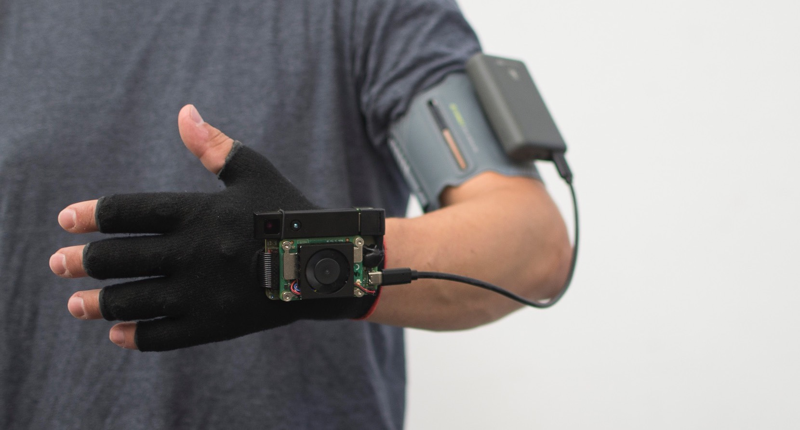

# The Unfolding Space Glove

**A Wearable Spatio-Visual to Haptic Sensory Substitution Device for Blind People**


## About the Project

The Unfolding Space Glove is an Open Source wearbale that **allows blind or visually impaired users to haptically sense the depth of their surrounding space** and thus (hopefully) better navigate through it. 

The device employs the concept of [Sensory Substitution](https://en.wikipedia.org/wiki/Sensory_substitution), which in simple terms states that if one sensory modality is missing, the brain is able to receive and process the missing information by means of another modality. There has been a great deal of research on this topic over the last 50 years, but as yet there is no widely used device on the market that implements these ideas. 

Initiated in 2018 as an interaction design project as part of my undergraduate thesis, I developed several prorotypes over the years, aiming to learn from the mistakes of other projects and use design methods to develop a more user-friendly device; the latest prototype was tested in 2021 in a study with blind and sighted (but blindfolded) subjects (see section Publication). 



### More Information on the Project

- [Project Website](https://unfoldingspace.org) with more information, images and press texts
- [Hackaday.io Project Page ](https://hackaday.io/project/163784-unfolding-space)with project logs, files and instructions
- [Publications on Researchgate](https://www.researchgate.net/project/Unfolding-Space) – previous scientific papers (German only, sorry)
- [Videos from the Study](https://vimeo.com/channels/1758883) – exemplary video clips from the study


### Publication

For February/March 2022 a publication in a scientific journal is planned. You will find the respective link and doi number here, as soon as it got published. The Abstract currently reads:

> **Abstract:**
>
> This paper documents the design, implementation and evaluation of the Unfolding Space Glove: an open source sensory substitution device that allows blind users to haptically sense the depth of their surrounding space. The prototype requires no external hardware, is highly portable, operates in all lighting conditions, and provides continuous and immediate feedback – all while being visually unobtrusive. Both blind (n = 8) and sighted but blindfolded subjects (n = 6) completed structured training and obstacle courses with the prototype and the white long cane to allow performance comparisons to be drawn between them. Although the subjects quickly learned how to use the glove and successfully completed all of the trials, they could not outperform their results with the white cane within the duration of the study. Nevertheless, the results indicate general processability of spatial information through sensory substitution by means of haptic, vibrotactile interfaces. Moreover, qualitative interviews revealed high levels of usability and user experience with the glove. Further research is necessary to investigate whether performance could be improved through further training, and how a fully functional navigational aid could be derived from this prototype.


### Future of the project

After 4 years of active development, I will let this project rest due to lack of time and money. Of course, questions, tips or feedback are always welcome and maybe the project will continue with or without me at another time. That would make me very happy indeed. Also see section "Future Directions" for things that have been started but couldn't be finished yet.


## Table of further Contents

   * [Content and Connected Repos](#content-and-connected-repos)
   * [Code Documentation](#code-documentation)
      * [Build &amp; Run](#build--run)
         * [Makefile](#makefile)
         * [Run](#run)
      * [Overall Code Structure](#overall-code-structure)
      * [Processing Procedure for New Incoming Frame](#processing-procedure-for-new-incoming-frame)
      * [UPD API (In- and Outputs)](#upd-api-in--and-outputs)
         * [Request-Messages](#request-messages)
         * [Status Messages](#status-messages)
      * [Docu on Registers of DRVs and PCAs](#docu-on-registers-of-drvs-and-pcas)
      * [Future Directions](#future-directions)
   * [Credits](#credits)
   * [Funding](#funding)


## Content and Connected Repos

You currently are in the **main repository of the project**, which contains the source code of the *unfolding-app* running on the Unfolding Space Glove (powered by a Raspberry Pi). The project also contains the following repos:

- **[Unfolding Space Hardware](https://github.com/jakobkilian/unfolding-space-hardware)**
  Documentation of the hardware (glove, electronics, ...) needed to run this project in the first place. Building instructions, blueprints, circuit board files, 3D design files. 
- **[Unfolding Space Monitor](https://github.com/jakobkilian/unfolding-space-monitor)**
  *Unity 3D* project (cross platform) of a monitoring app that receives data (depth image, motor values, logs) from the glove over Wifi an displays them on a tablet, smartphone or computer.
- **(perhaps soon: Docker Environment)**
  ... to crosscompile the code for raspi. Needs resvision to be published


## Code Documentation


### Build & Run

Note, that you can only reasonably run the code on specific hardware (the Unfolding Space Glove) which is documented in the afaorementioned hardware repo. A way to at least test the code would be to use pre-recorded 3d depth video clip: also see section *Future Directions*.

#### System

Code runs on the Raspberry Pi Compute Module 4 mounted on a custom carrier board – see hardware repo. To make things easier and to have a distro that is modifiable and already boots fast from the ground up, we use **Dietpi** as OS. The system is headless, things that consume boot time are reduced to a minimu, unnecessary stuff got uninstalled. In the end the app gets started at an early stage in boot (bevor e.g. setting up network) with a service in `/etc/systemd/system/`(Thanks to [Himesh Prasad](https://himeshp.blogspot.com/2018/08/fast-boot-with-raspberry-pi.html) for tips on fast booting). From power up to vibration (including e.g. init of camera) it now takes about 12 s.

#### Dependencies

Several libraries are used in the project:

- [Libroyale from pmdtechnologies ag](https://pmdtec.com/en/) which is **not** open source but freely accessible when buying a pico flexx cam which is an obligatory part of the hardware. (You need to allow the usb cam in `/etc/udev/rules.d`, see lib doc)
- [OpenCV: Open Source Computer Vision Library](https://github.com/opencv/opencv). Thanks to @github/Lauszus for [install inspritation](https://gist.github.com/Lauszus/c8ce73f3177d6455c27c)
- [Boost Library](https://www.boost.org) is used for udp communication. Install with package manager sudo `apt-get install boost`
- [WiringPi (Unofficial Mirror/Fork)](https://github.com/WiringPi/WiringPi) is used for i2c communication on the Raspi. 

#### Makefile

There is a Makefile to build the unfolding-app on a linux system. Please read comments for details on dependencies and usage.

#### Run

run with 

````bash
sudo LD_LIBRARY_PATH=/home/dietpi/libroyale/bin ./unfolding-app`
````

add options:

```bash
--help      | show help
--log       | enable general log functions – currently no effect
--printLogs | print log messages in console
--mode arg  | set pico flexx camera mode (int from 0:5)
```


### Overall Code Structure

The task of the unfolding app is to process the **3D images from the camera as quickly as possible and provide them as a vibration stimulus**. 

The libroyale library (itself in a separate thread) acts as the clock here: the callback function `DepthDataListener::onNewData()` indicates that a new frame of the camera is ready. This is then immediately copied in order to be able to return `onNewData()` (requirement of the library). The copied frame is then processed and send to the glove so that a new frames can already be received in this chain before an old one has completely passed through.

Passing the data between the frames involves a lot of locking and thus caution not prevent the code running in e.g. dead locks. Four threads are created in the main loop of the main.cpp – synchonised using `condition_variables` and `notify_one()` calls from the boost library.

- **Initialise** all components and **persist in an endless loop** (maintainig time based checks and logs)
- Managing the **UPD connections** and sending values to the monitoring app
- **Copy and Process incoming frame** and pass it to the sending frame
- **Send** the calculated motor values to the glove and **broadcast them via udp**


### Processing Procedure for New Incoming Frame

1. *libroyale* calls `DepthDataListener::onNewData()` when a new frame is ready – meaning that it finished its own processes and calculations and provides a `royale::DepthData` object, containing e.g. depth and confidence calue for each pixel in a two dimensional array.
2. Within onNewData() locks a aquired to not get in conflict with other processes reading the image file at the same time. Then the dataframe is copied to the global `Glob::royalDepthData.dat` to be accessible to all threads.
3. The processing thread is notified that a ne frame can be processed by using `notify_one()`
4. In `processData()`, the processing thread now **analyses the frame and creates a 3x3 matrix of motor values** as a result.
   1. Create some variables:
      - pointer to global frame object
      - an OpenCV matrix to save the image
      - define nine image tiles representing the 3x3 matrix of the output and create depth histograms for each (inside a matrix).
   2. Iterate through all pixels; calc a 0:256 depth value based on the predefined depth range; if measurement confindence (coming from libroyale) is high enough write value to a) the OpenCV matrix and b) the respective histogram of that pixel.
   3. Find the nearest object for each tile/histogram. 
      - Move a sliding window (starting at depth 0, i.e. close to the camera) over all bins of the histogram.
      - check whether or at which depth value the number of pixels in this window exceeds a predefined threshold. 
      - If this is the case, the closest object within this image tile is assumed to be that depth value. Write this value into the global 3x3 `Glob::motors.tiles` matrix
   4. Notify (`notify_one()`) the sending thread to transmit the new values to the glove and then send values, image and logs via udp to monitoring app.

And while the process of one frame might still be in point 4, a new frame can already be receiveid via `OnNewData()`. There is, however, no buffer implemented. If a new frame would arrive before the old one got copied, the old one gets overwritten to avoid any latency.

### UPD API (In- and Outputs)

To enable the monitoring-app to retrieve values, logs and the depth image, a UDP connection must be established and maintained. 

- The *development app* (which acts as a server) therefore sends its IP and identification number (important if there are several gloves in a network) on the local network on udp port 9008 once a second.
- *Monitoring-apps* (acting as a client) listen for these uptime messages on port 9908 and (if user selects a respective server via GUI) subscribe for information by sending a request-messages to the server's IP on port 9009.
- The server maintains a list of subscribed clients and drops IP addresses when they did not renew their request-message for  over one second. Whenever a new frame is finished processing or sending is invoked in other ways, the server sends requested information to all subscribed clients. For this asio strands from the boost library are used to create a sequential invocation of send commands by using `async_send_to()` 

#### Request-Messages 

The clients can request different type of information (depending e.g. on use case and network speed) and can control certain behaviour of the unfolding-app by adding information to its subscription message. They can also be combined

|char|description / *effect of following byte*|
|-|-|
| i | send full depth image as greyscale image.  |
|| *byte containing 1:9 ascii number: define size of the image (1 being 20x20 pixels only, 9 being the full image)* |
| m |"mute" the vibration motors / disable vibratory output |
| t | toggle test mode. Mute all motors and use test-values (defined by next command) |
| z | toggle motor test value for one motor (on/off) |
||  *byte containing 1:9 ascii number defines the motor to be switched *|
| u | change camera use case and restart app. Check pico flexx documentation for available use cases (fps and accuracy) |
|| *byte containing 1:5 ascii number defines the new camera use case.*  |
| c | run calibration process on all motors. Usually we use fixed calibration values to speed up starting time...

#### Status Messages

Status Messages get triggered from various locations of the CU's code and at various points of time. Some (e.g. the core temperature value) get sent more occasionally, some get send every incoming frame.
Every message starts with a ascii encoded key for better readability delimited by a ':' (hex value: 3A). After that the data gets transferred in a plain uchar array. It is therefore crucial to know the data type of the message...
These are the keys:

|msg|type|description|
|-|-|-|
| img          | [byte][array]      | pixel by pixel... |
| motors       | [byte][array]      | motor by motor... |
| frameCounter | [int]              | sequential number incremented every frame |
| coreTemp     | [float]            | Temperature of the Raspberry's core in ° C |
| fps          | [int]              | Frames per second on the CU |
| isConnected  | [bool]             | Is the Pico Flexx camera connected? |
| isCapturing  | [bool]             | Is the Pico Flexx camera in capturing mode? |
| libCrashes   | [int]              | How often did the royal library crash since startup? |
| isTestMode   | [bool]             | CU is in Test Mode: the motors represent the test values not the camera values |
| isMuted      | [bool]             | All motors are muted  |
| drpBridge    | [int]              | Lib Royale: How many frames got dropped at the bridge during the last deptFrame calculation? |
| drpFC        | [int]              | Lib Royale: How many frames got dropped at the FC during the last deptFrame calculation? |
| delivFrames  | [int]              | Lib Royale: How many frames got finally delivered |
| drpMinute    | [int]              | Lib Royale: Summation of all drops in the last minute |


### Docu on Registers of DRVs and PCAs

I use PCA9635 to multiplex the i2x connection to the DRV2605l chips that drive the motors. In /doc you can find a detailled documentation on them.


### Future Directions

**Unfortunately, some ideas never made it to implementation.** These are briefly presented here:

- Current Code is a bit bulky. Probably could be much more efficient and also be simpler by getting rid of all the locking due to global objects used my multiple threads. Refactoring of the code would be needed which has been started by a2800276 in two branches but not yet finished (both are **not yet running!)**:
  - *experiment-Refactoring-C++* | refactoring current code while staying in C++
  - *orph-Refactoring-Python* | entirely new approach in Python
- The most expensive part of the hardware is the ToF camera. To be able to **test the code without the camera attached,** pre-recorded material (saved as rrf file) could be used. The *feature-rrf-loading* attempts to do this, but is not yet ready to run either.
- The **hardware already contains a compass** (MMC5633) that could be used to show where to go (Google Maps navigation) or where north is by using vibration. The *feature-compass* branch contains a rough sketch for that purpose, which is again not yet ready to run. 


## Credits

The project wouldn't have been possible without the help of many people, to whom I would like to express a big thank you at this point:

- **Kjell Wistoff** for his active support in setting up, dismantling and rebuilding the study room, organising the documents and documenting the study photographically.
- Trainer **Regina Beschta** for a free introductory O\&M course and the loan of the study long cane.
- **[a2800276](https://github.com/a2800276)** and **[mattikra](https://github.com/mattikra)** from Press Every Key for their open ear when giving advice on software and hardware.
- **Köln International School of Design/KISD** (TH Köln) and the responsible parties for making the premises available over this long period of time.
- **pmdtechnologies** ag for providing a Pico Flexx camera.
- **Munitec GmbH**, for providing glove samples.
- All those who provided guidance in the development of the prototype over the past years and now in the implementation and evaluation of the study.


## Funding

The 2021-prototype was funded in two ways:

- The study on the device and related expenses were funded as part of my Master's Thesis in an industry-on-campus-cooperation between the University of Tuebingen and Carl Zeiss Vision International GmbH.

- In addition, the prototype construction was funded as part of the Kickstart@TH Cologne project of the StartUpLab@TH Cologne programme (``StartUpLab@TH Cologne'', funding reference 13FH015SU8, Federal Ministry of Education and Research – Germany / BMBF). 

